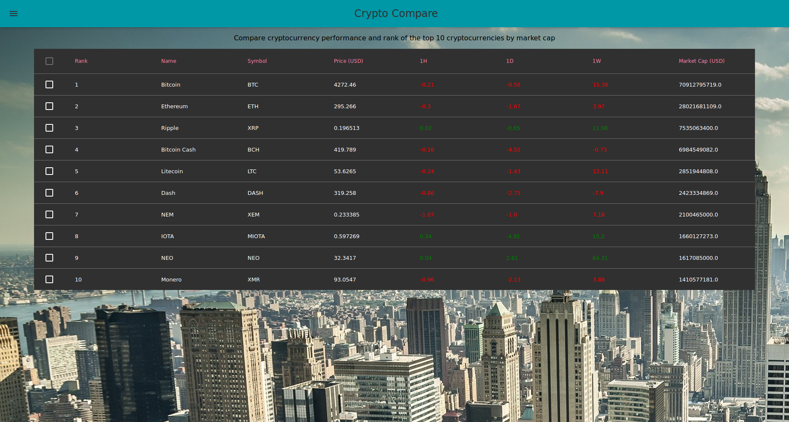

# CryptoCompare

### What it does

It provides you with fresh data each 4 minutes that pulls from various cryptocurrency data sources about the top 10 cryptos.

### A React frontend app with all the latest buzz:

- React v16
- ES6: async/await promises, classes, arrow functions
- Functional Stateless components
- Material-UI inspired on Material Design principles for styling
- About Crypto :)!
